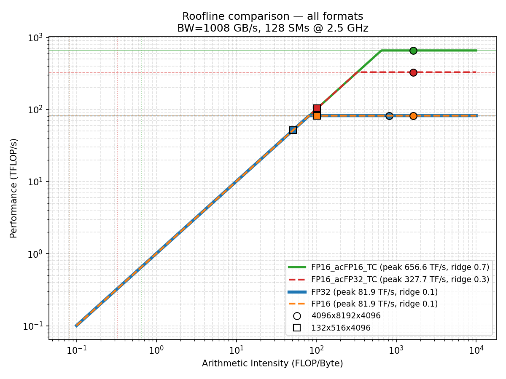

Here are the fixed tables with proper Markdown formatting for your README. I've corrected the alignment, cleaned up the formatting issues, and organized the data properly:

# 🚀 Extreme GEMM Optimization on RTX 4090 (Ada Lovelace)

This repository documents a comprehensive study to achieve the peak performance of the Ada Lovelace architecture (RTX 4090) in matrix multiplication operations (GEMM).

We compared the performance of different PyTorch compilation strategies (Eager, JIT, AOT) against native C++/CUDA implementations (cuBLAS).
- **First Version**: FP16/FP32
- **Second Version**: FP16/FP16
- **Third Version**: TF32

## 📐 Roofline Analysis



The roofline above (RTX 4090, BW = 1.008 TB/s) shows the four precision regimes evaluated and locates two reference matmuls on each curve:

- **4096 × 8192 × 4096** — AI ≈ **1638 FLOP/B**, far above every ridge point. **Compute-bound**: the workload sits on the flat ceiling for all formats, so peak TFLOPS is the limit.
- **132 × 516 × 4096** — AI ≈ **102.5 FLOP/B**, below the FP16 (≈ 163.9) and FP32 (≈ 81.9) ridge points for the Tensor Core formats. **Memory-bound**: the workload sits on the diagonal slope, leaving compute units idle.

**Ridge points (`I_crit = R_peak / β_mem`)**:

| Format | R_peak (TFLOPS) | I_crit (FLOP/B) |
|--------|-----------------|-----------------|
| FP32 (CUDA cores) | 82.6 | 81.9 |
| FP16 + FP32 acc (TC) | 165.2 | 163.9 |

A GEMM reaches its ridge when M ≳ 3·I_crit — roughly **M ≈ 246** for FP32 and **M ≈ 492** for FP16 Tensor Core. Below those sizes (and always when M = 1 or N = 1, since matvec AI < 1 FLOP/B), the operation is memory-bound regardless of architecture.

## 🔬 Testing Methodology

To ensure accurate measurements and avoid thermal throttling, all matrices were initialized to 0. Random data increases transistor switching activity, forcing the hardware to reduce clock frequencies due to power limitations.

The study is divided into two main phases:

**Phase 1: Square Matrices (Full Scaling)**
Analyze the hardware's response to incremental loads. Small (1024, 2048), medium (4096, 8192), and large (16384, 32768) dimensions were tested.

**Phase 2: Non-Square Matrices (Partial Load / Fixed-K)**
Designed to maintain sustained arithmetic intensity. The internal dimension was fixed at K=8192 to ensure Tensor Core saturation, while varying the M and N dimensions.

## 🛠️ Requirements and Dependencies

**Runoff Environment:**
- NVIDIA Container Toolkit: Required to expose the GPUs to the Docker container.
- Base Image: nvcr.io/nvidia/pytorch:23.11-py3 (Includes CUDA 12.0 and PyTorch 2.0+ pre-configured).

**Build Toolchain:**
- C++17 Compiler: gcc-10 and g++10
- Building Systems: cmake (>= 3.18), ninja-build, build-essential

**Core Libraries:**
- NVIDIA CUTLASS: C++ template library for high-performance linear algebra operations (compiled from source for 80 and 89 architectures).
- Python 3 and utilities (python3-dev, pip).


## 🚀 How to Run

To launch the complete benchmark suite, simply run the master script from the project root:

```bash
./benchmarks_executor.sh [OPTIONS]
```

### ⚙️ Available Options

**`--a [fp16 | fp32 | tf32 ]`**
- Description: Specifies the architecture mode (precision).
- Values:
  - `fp16` → Half precision (default)
  - `fp32` → Single precision
  - `tf32` → TensorFloat-32 (10-bit mantissa, 8-bit exponent) on Tensor Cores
- Example:
  ```bash
  ./benchmarks_executor.sh --a fp32
  ```

**`--profile`**
- Description: Enables profiling mode.
- Behavior: Activates profiling tools such as Nsight Systems and Nsight Compute.
- Example:
  ```bash
  ./benchmarks_executor.sh --profile
  ```

**`--sb`**
- Description: Skips benchmark execution.
- Behavior: Prevents benchmarks from running (useful for faster runs or debugging).
- Example:
  ```bash
  ./benchmarks_executor.sh --sb
  ```

**`-h`**
- Description: Displays help information.
- Example:
  ```bash
  ./benchmarks_executor.sh --help
  ```

## 🧪 Strategies Evaluated

1. **CUDA Native:** Maximum performance baseline using NVIDIA APIs (cuBLAS) directly from C++.

2. **PyTorch Eager:** Standard operation-by-operation execution.

3. **PyTorch JIT:** Uses `torch.compile` with:
   - `mode="max-autotune"`: Performs an exhaustive search by testing multiple tile configurations directly on the GPU to choose the absolute winner.
   - `dynamic=False`: Disables dynamic shape inference to ensure maximum performance (assumes static sizes).

4. **PyTorch AOT:** Pre-compilation. Uses `fullgraph=True` to ensure that 100% of the model is compiled on the GPU, silently preventing any return to the Python interpreter.

5. **Benchmark mma-matmul (FP16/FP32 Precision):** 
   This section evaluates the performance of High-Speed Matrix Multiplication (GEMM) using Tensor Cores on the NVIDIA Ada Lovelace architecture, based on the mma-matmul implementation.

   The `cublasGemmEx` API, utilizing FP16 inputs and FP32 accumulation, serves as the primary performance reference. For a matrix of dimensions $M=N=K=4096$, cuBLAS achieves an execution time of $895\ \mu s$. 

   To conduct a comprehensive comparison, a custom testbed (`ejecutador.sh`) was utilized to analyze a wide variety of matrix sizes. The benchmark covers the evolutionary progression of all kernels developed in this project, including versions 0.x, 1.x, 2.x, and 3.x (specifically kernels 0, 1, 10, 11, 20, 21, 30, 31, 32, 33, and 34). This allows for a detailed observation of performance gains—from the initial "naive" implementation to advanced asynchronous pipelining.

## 📊 First Version: FP16/FP32


## 📊 Second Version: FP16/FP16


## 📊 Third Version: TF32


## 🔬 MMA Kernel Progression (FP16/FP16 → FP32)

**Kernel comparison at 4096 × 4096 × 4096:**


**Square matrices (full scaling):**


**Fixed-K (K = 8192):**


# 📈 Performance Results - RTX 4090

## Reference Ceilings

| Configuration | Theoretical Peak (TFLOP/s) | CUTLASS Empirical Ceiling (TFLOP/s) |
|--------------|----------------------|-------------------------------|
| TF32 | 82.60 | 86.10 |
| FP16→FP32 | 165.20 | 167.90 |
| FP16→FP16 | 330.30 | 285.10 |

---

## TF32 Configuration

*Note: Configuration using `torch.set_float32_matmul_precision('high')` on `torch.float32` operands.*

### Square Mode (M=N=K)

| Size (M) | Eager | JIT | AOT | Best / peak |
|-----------|-------|-----|-----|--------------|
| 1,024 | 68.00 | 50.16 | 51.41 | 82.3% |
| 2,048 | 77.77 | 64.63 | 70.82 | 94.2% |
| 4,096 | 80.11 | 68.94 | 79.09 | 97.0% |
| 8,192 | 81.21 | 74.69 | 81.06 | 98.3% |
| 16,384 | 81.57 | 78.02 | 81.55 | 98.8% |
| 32,768 | 81.67 | — | 81.67 | 98.9% |

### Fixed K Mode (K=8,192)

| Size (M×N) | Eager | JIT | AOT |
|-------------|-------|-----|-----|
| 1,024×1,024 | 77.29 | 47.49 | 70.47 |
| 2,048×2,048 | 80.61 | 60.97 | 78.51 |
| 4,096×4,096 | 80.95 | 69.11 | 80.39 |
| 8,192×8,192 | 81.19 | 74.63 | 81.05 |
| 16,384×16,384 | 81.31 | — | 81.28 |
| 32,768×32,768 | 81.35 | — | 81.37 |

---

## FP16→FP32 Configuration

*Note: Mixed precision with `torch.float16` operands and FP32 accumulation. Configuration using `torch.backends.cuda.matmul.allow_fp16_accumulation = False`.*

### Square Mode (M=N=K)

| Size | Eager | JIT | AOT | Native CUDA | Spatters 3.1 | Best / peak |
|--------|-------|-----|-----|-------------|--------------|--------------|
| 1,024 | 55.12 | 60.70 | 91.59 | 170.02 | — | 102.9% |
| 2,048 | 150.66 | 76.08 | 122.35 | 169.97 | — | 102.9% |
| 4,096 | 160.54 | 159.44 | 159.56 | 169.65 | 153.55 | 102.7% |
| 8,192 | 155.78 | 171.95 | 161.18 | 169.17 | 155.96 | 104.1% |
| 16,384 | 168.29 | 173.01 | 173.82 | 168.98 | 157.35 | 105.2% |
| 32,768 | 166.81 | 172.10 | 172.58 | 168.98 | 157.66 | 104.5% |

### Fixed K Mode (K=8,192)

| Size | Eager | JIT | AOT | Native CUDA | Spatters 3.1 |
|--------|-------|-----|-----|-------------|--------------|
| 1,024×1,024 | 147.84 | 80.07 | 139.44 | 168.98 | 74.24 |
| 2,048×2,048 | 169.81 | 84.13 | 157.44 | 168.20 | 152.18 |
| 4,096×4,096 | 160.26 | 170.10 | 160.99 | 168.01 | 155.30 |
| 8,192×8,192 | 152.52 | 171.21 | 160.76 | 168.01 | 157.07 |
| 16,384×16,384 | 171.09 | 171.68 | 172.65 | 168.71 | 153.94 |
| 32,768×32,768 | 171.20 | 171.76 | 172.61 | 168.01 | 151.92 |

---

## FP16→FP16 Configuration

*Note: Maximum throughput with FP16 operands and accumulation. Configuration using `allow_fp16_accumulation = True` (PyTorch 2.7.0+).*

### Square Mode (M=N=K)

| Size | Eager | JIT | AOT | Native CUDA | Spatters 3.3 | Best / peak |
|--------|-------|-----|-----|-------------|--------------|--------------|
| 1,024 | 92.30 | 60.33 | 90.94 | 80.75 | 97.40 | 29.5% |
| 2,048 | 286.84 | 244.89 | 253.85 | 277.31 | 207.13 | 86.8% |
| 4,096 | 254.89 | 218.01 | 272.22 | 223.17 | 244.37 | 82.4% |
| 8,192 | 251.16 | 232.29 | 254.79 | 218.77 | 201.96 | 77.1% |
| 16,384 | 295.04 | 275.81 | 162.52* | 279.70 | 111.22** | 89.3% |
| 32,768 | 299.30 | 287.01 | 298.83 | — | 110.53** | 90.6% |

*\* Anomalous value discussed in AOT results section*  
*\*\* Anomalous value discussed in Spatters FP16→FP16 section*

### Fixed K Mode (K=8,192)

| Size | Eager | JIT | AOT | Native CUDA | Spatters 3.3 |
|--------|-------|-----|-----|-------------|--------------|
| 1,024×1,024 | 230.84 | 180.81 | 230.62 | 217.10 | 119.23 |
| 2,048×2,048 | 299.43 | 183.60 | 282.59 | 291.25 | 231.68 |
| 4,096×4,096 | 245.20 | 211.60 | 258.16 | 221.14 | 239.21 |
| 8,192×8,192 | 249.94 | 231.79 | 251.09 | 218.68 | 200.67 |
| 16,384×16,384 | 257.18 | 245.72 | 259.05 | 224.59 | 202.44 |
| 32,768×32,768 | 260.60 | 252.21 | 260.72 | 226.56 | 107.52 |

---

## Execution Times

### 4,096³ Matrices

| Implementation | TF32 | FP16→FP32 | FP16→FP16 |
|---------------|------|-----------|-----------|
| PyTorch eager | 1.716 | 0.856 | 0.539 |
| PyTorch JIT | 1.994 | 0.862 | 0.630 |
| PyTorch AOT | 1.738 | 0.861 | 0.505 |
| Native CUDA | — | 0.810 | 0.616 |
| Spatters | — | 0.895 | 0.562 |

### 16,384³ Matrices

| Implementation | TF32 | FP16→FP32 | FP16→FP16 |
|---------------|------|-----------|-----------|
| PyTorch eager | 107.84 | 52.27 | 29.81 |
| PyTorch JIT | 112.74 | 50.84 | 31.89 |
| PyTorch AOT | 107.87 | 50.60 | 54.12 |
| Native CUDA | — | 52.05 | 31.45 |
| Spatters | — | 55.90 | 79.08** |

*\*\* Anomalous value discussed in Spatters FP16→FP16 section*

---

## Efficiency vs. Empirical Ceiling

### Square Mode (M=N=K)

| Configuration | Implementation | 1,024 | 2,048 | 4,096 | 8,192 | 16,384 | 32,768 |
|--------------|---------------|-------|-------|-------|-------|--------|--------|
| **TF32** | Eager | 79.0% | 90.3% | 93.0% | 94.3% | 94.7% | 94.9% |
| | JIT | 58.3% | 75.1% | 80.1% | 86.7% | 90.6% | — |
| | AOT | 59.7% | 82.2% | 91.9% | 94.1% | 94.7% | 94.9% |
| **FP16→FP32** | Eager | 32.8% | 89.7% | 95.6% | 92.8% | 100.2% | 99.4% |
| | JIT | 36.2% | 45.3% | 95.0% | 102.4% | 103.0% | 102.5% |
| | AOT | 54.6% | 72.9% | 95.0% | 96.0% | 103.5% | 102.8% |
| | Native CUDA | 101.3% | 101.2% | 101.0% | 100.8% | 100.6% | 100.6% |
| | Spatters 3.1 | — | — | 91.5% | 92.9% | 93.7% | 93.9% |
| **FP16→FP16** | Eager | 32.4% | 100.6% | 89.4% | 88.1% | 103.5% | 105.0% |
| | JIT | 21.2% | 85.9% | 76.5% | 81.5% | 96.7% | 100.7% |
| | AOT | 31.9% | 89.0% | 95.5% | 89.4% | 57.0%* | 104.8% |
| | Native CUDA | 28.3% | 97.3% | 78.3% | 76.7% | 98.1% | — |
| | Spatters 3.3 | 34.2% | 72.7% | 85.7% | 70.8% | 39.0%** | 38.8%** |

*\* Anomalous value discussed in AOT results section*  
*\*\* Anomalous value discussed in Spatters FP16→FP16 section*

### Fixed K Mode (K=8,192)

| Configuration | Implementation | 1,024 | 2,048 | 4,096 | 8,192 | 16,384 | 32,768 |
|--------------|---------------|-------|-------|-------|-------|--------|--------|
| **TF32** | Eager | 89.8% | 93.6% | 94.0% | 94.3% | 94.4% | 94.5% |
| | JIT | 55.1% | 70.8% | 80.3% | 86.7% | — | — |
| | AOT | 81.9% | 91.2% | 93.4% | 94.1% | 94.4% | 94.5% |
| **FP16→FP32** | Eager | 88.1% | 101.1% | 95.5% | 90.8% | 101.9% | 102.0% |
| | JIT | 47.7% | 50.1% | 101.3% | 102.0% | 102.3% | 102.3% |
| | AOT | 83.0% | 93.8% | 95.9% | 95.7% | 102.8% | 102.8% |
| | Native CUDA | 100.6% | 100.2% | 100.1% | 100.1% | 100.5% | 100.1% |
| | Spatters 3.1 | 44.2% | 90.6% | 92.5% | 93.5% | 91.7% | 90.5% |
| **FP16→FP16** | Eager | 81.0% | 105.0% | 86.0% | 87.7% | 90.2% | 91.4% |
| | JIT | 63.4% | 64.4% | 74.2% | 81.3% | 86.2% | 88.5% |
| | AOT | 80.9% | 99.1% | 90.5% | 88.1% | 90.9% | 91.5% |
| | Native CUDA | 76.2% | 102.2% | 77.6% | 76.7% | 78.8% | 79.5% |
| | Spatters 3.3 | 41.8% | 81.3% | 83.9% | 70.4% | 71.0% | 37.7% |

---

## Spatters Results - MMA Matmul Benchmark

### cuBLAS GemmEx (baseline)

| Kernel | Type | M | N | K | Time (ms) | TFLOPS |
|--------|------|---|---|---|-----------|--------|
| cuBLAS GemmEx | Square | 1024 | 1024 | 1024 | 0.0220 | 97.84 |
| cuBLAS GemmEx | Square | 2048 | 2048 | 2048 | 0.1207 | 141.92 |
| cuBLAS GemmEx | Square | 4096 | 4096 | 4096 | 0.8952 | 153.53 |
| cuBLAS GemmEx | Square | 8192 | 8192 | 8192 | 6.8000 | 161.69 |
| cuBLAS GemmEx | Square | 16384 | 16384 | 16384 | 54.0800 | 162.65 |
| cuBLAS GemmEx | Square | 32768 | 32768 | 32768 | 466.3600 | 150.89 |
| cuBLAS GemmEx | Fixed_K | 8192 | 8192 | 8192 | 6.8200 | 161.22 |

### k1.0 Naive mma

| Kernel | Type | M | N | K | Time (ms) | TFLOPS |
|--------|------|---|---|---|-----------|--------|
| k1.0 Naive mma | Square | 1024 | 1024 | 1024 | 0.0815 | 26.35 |
| k1.0 Naive mma | Square | 2048 | 2048 | 2048 | 0.6068 | 28.23 |
| k1.0 Naive mma | Square | 4096 | 4096 | 4096 | 4.7000 | 29.24 |
| k1.0 Naive mma | Square | 8192 | 8192 | 8192 | 40.8800 | 26.90 |
| k1.0 Naive mma | Square | 16384 | 16384 | 16384 | 503.8600 | 17.46 |
| k1.0 Naive mma | Square | 32768 | 32768 | 32768 | 3860.0000 | 18.23 |
| k1.0 Naive mma | Fixed_K | 8192 | 8192 | 8192 | 40.8900 | 26.89 |
| k1.0 Naive mma | Fixed_K | 16384 | 16384 | 8192 | 162.2900 | 27.10 |
| k1.0 Naive mma | Fixed_K | 32768 | 32768 | 8192 | 632.8900 | 27.80 |

### k1.1 Naive mma + 2x tiling

| Kernel | Type | M | N | K | Time (ms) | TFLOPS |
|--------|------|---|---|---|-----------|--------|
| k1.1 + 2x tiling | Square | 1024 | 1024 | 1024 | 0.0505 | 42.50 |
| k1.1 + 2x tiling | Square | 2048 | 2048 | 2048 | 0.3301 | 51.89 |
| k1.1 + 2x tiling | Square | 4096 | 4096 | 4096 | 2.4100 | 57.03 |
| k1.1 + 2x tiling | Square | 8192 | 8192 | 8192 | 19.7200 | 55.76 |
| k1.1 + 2x tiling | Square | 16384 | 16384 | 16384 | 161.4400 | 54.49 |
| k1.1 + 2x tiling | Square | 32768 | 32768 | 32768 | 1310.0000 | 53.72 |
| k1.1 + 2x tiling | Fixed_K | 8192 | 8192 | 8192 | 19.7300 | 55.73 |
| k1.1 + 2x tiling | Fixed_K | 16384 | 16384 | 8192 | 80.3600 | 54.73 |
| k1.1 + 2x tiling | Fixed_K | 32768 | 32768 | 8192 | 322.1800 | 54.60 |

### k2.0 Permuted shmem

| Kernel | Type | M | N | K | Time (ms) | TFLOPS |
|--------|------|---|---|---|-----------|--------|
| k2.0 Perm. shmem | Square | 1024 | 1024 | 1024 | 0.0263 | 81.75 |
| k2.0 Perm. shmem | Square | 2048 | 2048 | 2048 | 0.1692 | 101.23 |
| k2.0 Perm. shmem | Square | 4096 | 4096 | 4096 | 1.1000 | 124.94 |
| k2.0 Perm. shmem | Square | 8192 | 8192 | 8192 | 10.3100 | 106.65 |
| k2.0 Perm. shmem | Square | 16384 | 16384 | 16384 | 273.0500 | 32.21 |
| k2.0 Perm. shmem | Square | 32768 | 32768 | 32768 | 2260.0000 | 31.14 |
| k2.0 Perm. shmem | Fixed_K | 1024 | 1024 | 8192 | 0.1880 | 91.40 |
| k2.0 Perm. shmem | Fixed_K | 2048 | 2048 | 8192 | 0.5818 | 117.89 |
| k2.0 Perm. shmem | Fixed_K | 4096 | 4096 | 8192 | 2.1800 | 126.09 |
| k2.0 Perm. shmem | Fixed_K | 8192 | 8192 | 8192 | 10.3100 | 106.65 |
| k2.0 Perm. shmem | Fixed_K | 16384 | 16384 | 8192 | 85.0500 | 51.71 |
| k2.0 Perm. shmem | Fixed_K | 32768 | 32768 | 8192 | 575.0800 | 30.59 |

### k2.1 Permuted shmem + reg tweak

| Kernel | Type | M | N | K | Time (ms) | TFLOPS |
|--------|------|---|---|---|-----------|--------|
| k2.1 Perm. + reg | Square | 1024 | 1024 | 1024 | 0.0252 | 85.29 |
| k2.1 Perm. + reg | Square | 2048 | 2048 | 2048 | 0.1701 | 100.73 |
| k2.1 Perm. + reg | Square | 4096 | 4096 | 4096 | 1.0400 | 132.15 |
| k2.1 Perm. + reg | Square | 8192 | 8192 | 8192 | 9.2200 | 119.25 |
| k2.1 Perm. + reg | Square | 16384 | 16384 | 16384 | 270.7000 | 32.49 |
| k2.1 Perm. + reg | Square | 32768 | 32768 | 32768 | 2260.0000 | 31.14 |
| k2.1 Perm. + reg | Fixed_K | 1024 | 1024 | 8192 | 0.1820 | 94.41 |
| k2.1 Perm. + reg | Fixed_K | 2048 | 2048 | 8192 | 0.5444 | 125.99 |
| k2.1 Perm. + reg | Fixed_K | 4096 | 4096 | 8192 | 2.0700 | 132.79 |
| k2.1 Perm. + reg | Fixed_K | 8192 | 8192 | 8192 | 9.2100 | 119.38 |
| k2.1 Perm. + reg | Fixed_K | 16384 | 16384 | 8192 | 84.8400 | 51.84 |
| k2.1 Perm. + reg | Fixed_K | 32768 | 32768 | 8192 | 574.9600 | 30.60 |

### k3.0 N-stage async pipeline

| Kernel | Type | M | N | K | Time (ms) | TFLOPS |
|--------|------|---|---|---|-----------|--------|
| k3.0 Async pipe | Square | 4096 | 4096 | 4096 | 1.0100 | 136.08 |
| k3.0 Async pipe | Square | 8192 | 8192 | 8192 | 9.1600 | 120.03 |
| k3.0 Async pipe | Square | 16384 | 16384 | 16384 | 83.1400 | 105.80 |
| k3.0 Async pipe | Square | 32768 | 32768 | 32768 | 728.3500 | 96.61 |
| k3.0 Async pipe | Fixed_K | 1024 | 1024 | 8192 | 0.1439 | 119.35 |
| k3.0 Async pipe | Fixed_K | 2048 | 2048 | 8192 | 0.5453 | 126.02 |
| k3.0 Async pipe | Fixed_K | 4096 | 4096 | 8192 | 2.1400 | 128.45 |
| k3.0 Async pipe | Fixed_K | 8192 | 8192 | 8192 | 9.1100 | 120.69 |
| k3.0 Async pipe | Fixed_K | 16384 | 16384 | 8192 | 42.8200 | 102.71 |
| k3.0 Async pipe | Fixed_K | 32768 | 32768 | 8192 | 178.6300 | 98.48 |

### k3.1 N-stage + 4x tiling

| Kernel | Type | M | N | K | Time (ms) | TFLOPS |
|--------|------|---|---|---|-----------|--------|
| k3.1 + 4x tiling | Square | 4096 | 4096 | 4096 | 0.8951 | 153.55 |
| k3.1 + 4x tiling | Square | 8192 | 8192 | 8192 | 7.0500 | 155.96 |
| k3.1 + 4x tiling | Square | 16384 | 16384 | 16384 | 55.9000 | 157.35 |
| k3.1 + 4x tiling | Square | 32768 | 32768 | 32768 | 446.3200 | 157.66 |
| k3.1 + 4x tiling | Fixed_K | 1024 | 1024 | 8192 | 0.2314 | 74.24 |
| k3.1 + 4x tiling | Fixed_K | 2048 | 2048 | 8192 | 0.4516 | 152.18 |
| k3.1 + 4x tiling | Fixed_K | 4096 | 4096 | 8192 | 1.7700 | 155.30 |
| k3.1 + 4x tiling | Fixed_K | 8192 | 8192 | 8192 | 7.0000 | 157.07 |
| k3.1 + 4x tiling | Fixed_K | 16384 | 16384 | 8192 | 28.5700 | 153.94 |
| k3.1 + 4x tiling | Fixed_K | 32768 | 32768 | 8192 | 115.8000 | 151.92 |

### k3.2 N-stage 2-stage FP16/FP32 acc

| Kernel | Type | M | N | K | Time (ms) | TFLOPS |
|--------|------|---|---|---|-----------|--------|
| k3.2 2-stage | Square | 4096 | 4096 | 4096 | 0.6826 | 201.34 |
| k3.2 2-stage | Square | 8192 | 8192 | 8192 | 5.3900 | 203.99 |
| k3.2 2-stage | Square | 16384 | 16384 | 16384 | 45.2400 | 194.43 |
| k3.2 2-stage | Square | 32768 | 32768 | 32768 | 380.8500 | 184.77 |
| k3.2 2-stage | Fixed_K | 1024 | 1024 | 8192 | 0.1672 | 102.77 |
| k3.2 2-stage | Fixed_K | 2048 | 2048 | 8192 | 0.3414 | 201.30 |
| k3.2 2-stage | Fixed_K | 4096 | 4096 | 8192 | 1.3200 | 208.24 |
| k3.2 2-stage | Fixed_K | 8192 | 8192 | 8192 | 5.4300 | 202.49 |
| k3.2 2-stage | Fixed_K | 16384 | 16384 | 8192 | 24.2400 | 181.44 |
| k3.2 2-stage | Fixed_K | 32768 | 32768 | 8192 | 102.0900 | 172.32 |

### k3.3 FP16 acc, FP32 at end

| Kernel | Type | M | N | K | Time (ms) | TFLOPS |
|--------|------|---|---|---|-----------|--------|
| k3.3 FP16/FP32 end | Square | 4096 | 4096 | 4096 | 0.5559 | 247.24 |
| k3.3 FP16/FP32 end | Square | 8192 | 8192 | 8192 | 4.5600 | 241.12 |
| k3.3 FP16/FP32 end | Square | 16384 | 16384 | 16384 | 39.7700 | 221.17 |
| k3.3 FP16/FP32 end | Square | 32768 | 32768 | 32768 | 344.3800 | 204.33 |
| k3.3 FP16/FP32 end | Fixed_K | 1024 | 1024 | 8192 | 0.1331 | 129.08 |
| k3.3 FP16/FP32 end | Fixed_K | 2048 | 2048 | 8192 | 0.2812 | 244.40 |
| k3.3 FP16/FP32 end | Fixed_K | 4096 | 4096 | 8192 | 1.0900 | 252.18 |
| k3.3 FP16/FP32 end | Fixed_K | 8192 | 8192 | 8192 | 4.5600 | 241.12 |
| k3.3 FP16/FP32 end | Fixed_K | 16384 | 16384 | 8192 | 20.8900 | 210.53 |
| k3.3 FP16/FP32 end | Fixed_K | 32768 | 32768 | 8192 | 87.7400 | 200.50 |

### k3.4 1-stage FP16, FP32 acc

| Kernel | Type | M | N | K | Time (ms) | TFLOPS |
|--------|------|---|---|---|-----------|--------|
| k3.4 1-stage | Square | 4096 | 4096 | 4096 | 0.6716 | 204.65 |
| k3.4 1-stage | Square | 8192 | 8192 | 8192 | 5.2500 | 209.43 |
| k3.4 1-stage | Square | 16384 | 16384 | 16384 | 43.0100 | 204.51 |
| k3.4 1-stage | Square | 32768 | 32768 | 32768 | 370.1900 | 190.09 |
| k3.4 1-stage | Fixed_K | 1024 | 1024 | 8192 | 0.1843 | 93.21 |
| k3.4 1-stage | Fixed_K | 2048 | 2048 | 8192 | 0.3432 | 200.25 |
| k3.4 1-stage | Fixed_K | 4096 | 4096 | 8192 | 1.2800 | 214.75 |
| k3.4 1-stage | Fixed_K | 8192 | 8192 | 8192 | 5.2500 | 209.43 |
| k3.4 1-stage | Fixed_K | 16384 | 16384 | 8192 | 24.1400 | 182.19 |
| k3.4 1-stage | Fixed_K | 32768 | 32768 | 8192 | 97.9400 | 179.62 |

## Results Eager


.png)


---

## Results JIT


.png)


---

## Results AOT


.png)


---

## Citation

If you use this library in your research, please cite:

```bibtex
@software{Pytorch_Matmul_BenchMark,
    author = {Maria Garcia Miñarro},
    title = {Pytorch vs Cuda (CuTe) Matmul BenchMark},
    url = {https://github.com/Mariiagrm/Python_Matmul_Benchmark},
    year = {2026}
}
```

## Acknowledgements

This project uses CUTLASS for optimized CUDA kernels.
